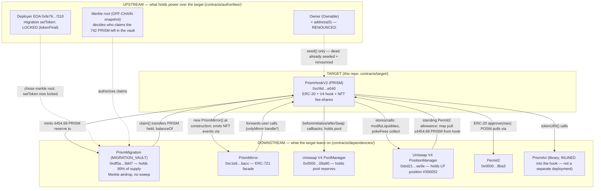

# Prism (PRISM) — Audit Bundle

Self-contained, audit-ready source + evidence for the **PrismHookV2** deployment on **Ethereum
mainnet**. Everything an auditor needs to reason about the target's security is in this repo: the
full source of the target and of every contract it is wired to (upstream and downstream, proxies
resolved to real implementations), a live-state snapshot, integrity checks of the shared building
blocks against real upstream, empirical simulations of the permissionless surface from an
unprivileged caller, and an explicit list of what remains unresolved.

> This bundle does **not** assess exploitability. Its job is to make sure that when the audit
> begins, nothing that bears on the target's security is unread, unrecovered, or unnamed.

---

## 1. The target

| | |
|---|---|
| **Name / symbol** | Prism / `PRISM` (ERC-20, 18 decimals, fixed supply 5,000) |
| **Address** | [`0xcf4d29f14cc585ddd1167f956092852af844e040`](https://etherscan.io/address/0xcf4d29f14cc585ddd1167f956092852af844e040) |
| **Chain** | Ethereum mainnet (chainId 1) |
| **Compiler** | Solidity `0.8.26+commit.8a97fa7a`, optimizer 200 runs, **viaIR**, EVM `cancun` |
| **Verified?** | Yes (Etherscan). Source in [`contracts/target/`](contracts/target/) |
| **Deployer (tx.origin)** | `0xfe76f05a01163e5c90329a0d1a2c8e389fd0f110` (EOA) |
| **Creation tx** | `0x58e2f85fa15bb52c3c4c461926fdca522d176b4d4870eba4709c99cc9178ae67` |

PrismHookV2 is a single bespoke contract that is **three things at once**:

1. an **ERC-20** token (`PRISM`) — Solady `ERC20` base;
2. a **Uniswap V4 hook** (permissions: `beforeInitialize` + `afterSwap`) that owns one V4
   position and is the host pool's only legitimate initializer; and
3. an **NFT fee-share system** — every whole PRISM token a non-excluded holder owns is mirror-minted
   as one ERC-721 "fee-share" (exposed via a separate `PrismMirror` contract). Pool fees are pulled
   from the V4 position by `pokeFees()` and distributed to fee-shares through a per-share debt ledger
   (`accFeesPerShareETH/PRISM`, `pendingETH/PRISM`).

The fund-moving functions — `pokeFees`, `claim`, `claimMany`, `withdrawPending`, `withdrawPendingTo`,
`syncNFTs` — are **permissionless** (see [§6 simulations](#6-empirical-simulations)). The contract is
**immutable and, as of this snapshot, admin-less** (owner renounced — see [§4](#4-authorities-what-holds-power-over-the-target)).

---

## 2. Trust graph

The map resolves in a small, closed set of contracts. Everything the target reaches, and everything
that holds power over it, is in this repo.



**The graph stops growing here.** The migration vault points only back to the hook; the mirror
points only back to the hook; PrismArt is inlined; the three Uniswap contracts are canonical
mainnet infrastructure (integrity-checked in [§5](#5-integrity-of-shared-building-blocks)). No
contract in the value path reaches an address that isn't in this repo.

---

## 3. Downstream — what the target leans on

Full source for each is under [`contracts/dependencies/`](contracts/dependencies/). All are
**verified** on Etherscan; each folder has a `_meta.json` (address, compiler, codesize) and, where
multi-file, a `_standard_input.json` and `_abi.json`.

| Contract | Address | Location | Verified | Role & value it holds |
|---|---|---|:--:|---|
| **PrismMigration** | `0xdf0a…9d47` | [`dependencies/PrismMigration/`](contracts/dependencies/PrismMigration/) | ✅ | **The single biggest piece of the surface.** Was minted **4,454.68 PRISM (89% of supply)** at the hook's construction; **742.40 PRISM still held** (rest claimed). Merkle-gated airdrop; permissionless `claim`; **no sweep** — unclaimed PRISM is trustlessly locked. See its [analysis](contracts/dependencies/PrismMigration/ANALYSIS.md). |
| **PrismMirror** | `0xc1e6…bacc` | [`dependencies/PrismMirror/`](contracts/dependencies/PrismMirror/) | ✅ | ERC-721 façade (`PRISM-LP`). Holds no funds, no independent authority — forwards `msg.sender` to the hook as `caller`; all state & checks live in the hook. Deployed by the hook in the creation tx; `mirror.hook()` ↔ `hook.mirror()` binding verified. |
| **Uniswap V4 PoolManager** | `0x0000…08a90` | [`dependencies/UniswapV4-PoolManager/`](contracts/dependencies/UniswapV4-PoolManager/) | ✅ | Canonical V4 singleton. Holds the pool reserves (**215.95 PRISM** of this pool + commingled ETH across all pools). Not a proxy. |
| **Uniswap V4 PositionManager (POSM)** | `0xbd21…ee9e` | [`dependencies/UniswapV4-PositionManager/`](contracts/dependencies/UniswapV4-PositionManager/) | ✅ | Canonical V4. Holds the hook's LP **position NFT #356052** (`ownerOf` = hook, verified). `pokeFees` collects fees through it. Not a proxy. |
| **Permit2** | `0x0000…8ba3` | [`dependencies/Permit2/`](contracts/dependencies/Permit2/) | ✅ | Canonical. Carries a **standing allowance**: POSM may pull up to **4,454.68 PRISM** from the hook (exp = uint48 max). Bounded by the hook's actual PRISM balance; POSM only acts on hook-initiated calls. |
| **Uniswap V4 StateView** | `0x7ffe…7227` | [`dependencies/UniswapV4-StateView/`](contracts/dependencies/UniswapV4-StateView/) | ✅ | Read-only helper; used to read pool liquidity/price for the live-state snapshot. |
| **PrismArt** | *(inlined)* | [`contracts/target/src/PrismArt.sol`](contracts/target/src/PrismArt.sol) | n/a | On-chain SVG art library. **All functions `internal`/`private` → compiled INTO the hook bytecode; not a separate on-chain contract.** Pure metadata; touches no value. |

---

## 4. Authorities — what holds power over the target

The worst cases hide here. Documented in [`contracts/authorities/README.md`](contracts/authorities/README.md).
Bottom line: **at this snapshot, no live on-chain authority can move the target's funds or change its rules.**

| Authority | Who | Live power | Evidence |
|---|---|---|---|
| **Owner** (`Ownable`) | was deployer `0xfe76…f110` | **NONE.** `owner()` = `address(0)` — **renounced.** Only `onlyOwner` fn is `seed()`, already spent. Solady's ownership-handover cannot revive it (completion is `onlyOwner`). | `owner()`→0; `seed(...)` reverts `Unauthorized()` even from the ex-owner ([sim](simulations/permissionless_caller_matrix.json)). |
| **Migration deployer** | `0xfe76…f110` (EOA) | **NONE now.** Its only power was `setToken` (correctable until the first claim); `tokenFinal` = **true**, so it's locked. | `tokenFinal()`→true; `setToken(x)` reverts `TokenLocked()` even from the deployer ([sim](simulations/permissionless_caller_matrix.json)). |
| **Mirror** | `0xc1e6…bacc` | Can call the hook's `onlyMirror` `handle*` fns — but only ever forwards a real user's `msg.sender`; never originates a call to itself. | Source: `PrismMirror` has no self-call path; `handle*` reverts `MirrorOnly()` for any other caller ([sim](simulations/permissionless_caller_matrix.json)). |
| **POSM (via Permit2)** | `0xbd21…ee9e` | Standing allowance to pull ≤4,454.68 PRISM from the hook. POSM is canonical and only pulls on hook-initiated `modifyLiquidities`. | `Permit2.allowance(hook,PRISM,POSM)` = 4454.68 / exp max / nonce 0. |
| **Merkle root** | off-chain snapshot, chosen by deployer at vault construction | Decides who may claim the **742.40 PRISM** still in the vault (and, historically, the 3,712 already out). Immutable. | Root `0x2cd6…e12f`. Behavioural evidence in [§7](#7-off-chain-components) — 321 distinct real claimants; top two match the source's documented snapshot figures. |

---

## 5. Integrity of shared building blocks

Full method + results in [`integrity/README.md`](integrity/README.md); machine-readable in
[`integrity/onchain_crosscheck.json`](integrity/onchain_crosscheck.json) and
[`integrity/github_crosscheck.json`](integrity/github_crosscheck.json); diffs in
[`integrity/diffs/`](integrity/diffs/).

Every Solady / Uniswap-V4 / Permit2 file bundled in the target's verified source was checked
**against real upstream** — the actual on-chain Uniswap deployments and the official GitHub repos —
not against a project-supplied copy.

- **Value-bearing Solady is clean:** `ERC20.sol`, `Ownable.sol`, `ReentrancyGuard.sol` are
  **byte-identical to Solady `main`.**
- **30/42** V4/Permit2 library files are **byte-identical to the real on-chain Uniswap contracts**.
- The remaining files differ **only by benign version drift** — the target pins a *newer* v4-core
  (structs moved to `PoolOperation.sol`) than the older deployed PoolManager, and an *older* Solady
  (`Base64`/`LibString`/`LibBytes` differ from current `main` only in signature line-wrapping and
  internal variable renames — metadata-only utilities, no logic change). Actions.sol differs only by
  constants `main` *added* later. **No file was found quietly altered.** Every diff is saved.

---

## 6. Empirical simulations

`eth_call` from an **arbitrary unprivileged EOA** (`0x1111…1111`) against **current chain state**,
capturing success vs. revert (custom-error selectors decoded). Full matrix:
[`simulations/permissionless_caller_matrix.json`](simulations/permissionless_caller_matrix.json),
narrative in [`simulations/README.md`](simulations/README.md).

- **Permissionless surface is live & reachable:** `pokeFees()`, `claim(id)`, `claimMany([id])`,
  `withdrawPending()`, `withdrawPendingTo(x)`, `syncNFTs(0)` all **execute** from a stranger.
- **Value actually moves:** a real holder with a pending balance withdrew it successfully in
  simulation; `pendingFees(562)` shows live accrued ETH+PRISM the permissionless `claim` realizes
  **for the token owner** (claims credit the owner, not the caller).
- **Guards hold at current state:** `withdrawPendingTo(PoolManager)`→`ExcludedRecipient`,
  `withdrawPendingTo(0)`→`TransferToZero`, `handle*` from non-mirror→`MirrorOnly`,
  `syncNFTs` from an excluded address→`ExcludedRecipient`.
- **No privileged escape hatch:** `seed(...)`→`Unauthorized()` (even from ex-owner);
  migration `setToken`→`TokenLocked()` (even from deployer); `NotDeployer` for a stranger.
- **Migration:** `claim` with a bogus proof→`InvalidProof`; a re-claim of a claimed account→`AlreadyClaimed`.

---

## 7. Off-chain components

There is **one** off-chain component in the trust path — the **migration Merkle snapshot** (the tree
behind `merkleRoot 0x2cd6…e12f`). No bytecode, no address to simulate. Detailed in
[`UNRESOLVED.md`](UNRESOLVED.md). On-chain evidence bounding it (from
[`live-state/events_summary.json`](live-state/events_summary.json)):

- **321 `Claimed` events → 321 distinct recipients**, totaling **3,712.27 PRISM** — a genuine broad
  distribution, not a disguised single-address allocation.
- The two largest claims (**287.24** and **228.04 PRISM**) **exactly match** the "287.24 and 228.04
  PRISM" the PrismHookV2 source itself cites as the two largest holders of its *published* snapshot —
  strong evidence the on-chain root corresponds to the advertised tree.
- `TokenSet` fired **once** (→ the hook); `PokeCollectFailed` = **0** (no silent fee-collection
  backlog); `FeesForfeited` = **1** (the by-design seed-time forfeit).

The residual question the chain cannot answer is stated in `UNRESOLVED.md`.

---

## 8. Live state (snapshot)

Machine-readable: [`live-state/live_state.json`](live-state/live_state.json). Highlights:

| Metric | Value |
|---|---|
| `totalSupply` | 5,000 PRISM |
| Supply location | migration vault **742.40**, pool (PoolManager) **215.95**, hook fee-reserve **13.26**, burn sink **8.78**, deployer **1.67**, rest (~4,018) held by claimants/traders |
| Hook ETH balance | **3.17 ETH** (undistributed/pending fees) |
| `totalShares` (live fee-share NFTs) | **3,834** |
| Hook LP position | POSM **#356052**, `ownerOf` = hook ✅ |
| Pool price | tick **11398** ⇒ ~**0.32 ETH/PRISM** (matches DexScreener ~0.325) |
| Pool liquidity (StateView `getLiquidity`) | 204,958,960,128,548,666,643 |
| `owner()` | **`address(0)` (renounced)** |
| Migration `tokenFinal` / `token` | **true** / the hook ✅ |

---

## 9. Repo layout

```
contracts/
  target/                        PrismHookV2 full verified source tree (46 files: hook, PrismMirror,
                                 PrismArt, BaseHook + Solady + Uniswap V4 + Permit2 libs)
  dependencies/                  downstream — everything the target leans on (full source each)
    PrismMigration/  PrismMirror/  UniswapV4-PoolManager/  UniswapV4-PositionManager/
    Permit2/  UniswapV4-StateView/
  authorities/                   upstream — who holds power (README; the authorities are EOAs/off-chain)
live-state/                      live_state.json, events_summary.json, binding_and_provenance.json
simulations/                     permissionless_caller_matrix.json (+ README)
integrity/                       README, on-chain & GitHub cross-checks, diffs/
tools/                           the exact scripts used to gather all of the above (reproducible)
UNRESOLVED.md                    explicit list of what remains genuinely unresolved
```

All on-chain data captured at snapshot time (2026-08-16) via Etherscan V2 API + `eth_call`. The
scripts in [`tools/`](tools/) reproduce every JSON artifact.
